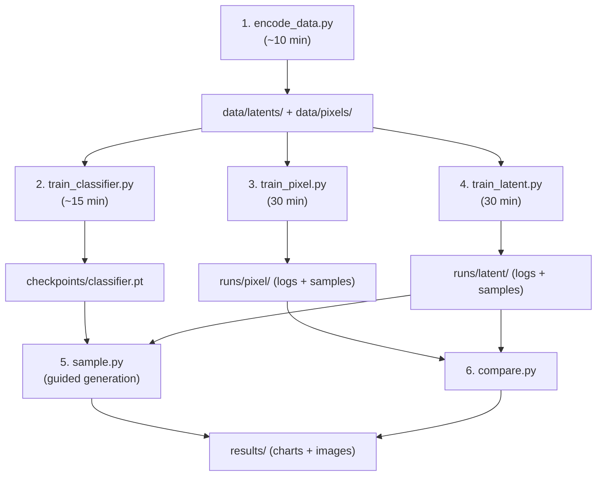

# Latent Diffusion Model — ADM Architecture (Final Plan)

## Goal

Build a **Latent Diffusion Model** faithfully implementing the OpenAI ADM architecture with a dual-training comparison workflow:

- **Baseline**: Full pixel-space UNet training (slow, expensive)
- **Evolution**: Latent-space UNet + LoRA fine-tuning (fast, efficient)
- **Steering**: Classifier Guidance via a separate auxiliary classifier trained on noisy images

**Dataset**: CIFAR-10 subset (~1,000 images per class)  
**Hardware**: RTX 3060 6GB VRAM  
**Reference**: Dhariwal & Nichol, "Diffusion Models Beat GANs on Image Synthesis" (2021)

---

## Confirmed Architecture Spec

The user has confirmed the following ADM "ablated standard":

| Component | Specification |
|---|---|
| **ResBlocks** | BigGAN-style (with up/downsampling integrated inside the block) |
| **Normalization** | AdaGN — conditioning on timestep + class embedding |
| **Attention** | Multi-head self-attention, **64 channels per head** (fixed head width), at resolutions **32×32, 16×16, 8×8** |
| **Guidance** | **External gradient-based classifier guidance** (requires a separate classifier network trained on noisy images) |

### AdaGN Formula (confirmed)

```
conditioning = timestep_emb + class_emb
[w_s, w_b] = Linear(conditioning)
AdaGN(h, y) = w_s · GroupNorm(h) + w_b
```

### Classifier Guidance Formula

During sampling, the noise prediction is steered using gradients from a separately trained classifier:

```
ε̂(x_t, t, y) = ε_θ(x_t, t) − s · σ_t · ∇_{x_t} log p_φ(y | x_t)
```

Where `s` is the **guidance scale** (typically 1.0–4.0) and `p_φ` is the auxiliary classifier.

---

## Architecture Overview

```
┌──────────────────────────────────────────────────────────────────────┐
│                        FULL SYSTEM DIAGRAM                            │
│                                                                      │
│  CIFAR-10 subset → Resize 256×256                                    │
│       │                                                              │
│  ┌────▼─────┐                                                        │
│  │  SD-VAE  │ (frozen, encode once via encode_data.py)               │
│  └────┬─────┘                                                        │
│       │                                                              │
│  Latents (4ch, 32×32)    Noisy Latents (4ch, 32×32)                  │
│       │                        │                                     │
│  ┌────▼──────────┐     ┌───────▼───────────┐                         │
│  │  ADM UNet     │     │  Aux Classifier   │                         │
│  │  + LoRA(R=16) │     │  (noisy images    │                         │
│  │  Predicts ε   │     │   → class logits) │                         │
│  └────┬──────────┘     └───────┬───────────┘                         │
│       │                        │                                     │
│       │    ∇_{x_t} log p(y|x_t)                                     │
│       │◄───────────────────────┘                                     │
│       │                                                              │
│  Guided ε̂ (steered toward class y)                                   │
│       │                                                              │
│  ┌────▼─────┐                                                        │
│  │  SD-VAE  │ (decode at sample time)                                │
│  │  Decoder │                                                        │
│  └────┬─────┘                                                        │
│       │                                                              │
│  Output Image (3ch, 256×256)                                         │
└──────────────────────────────────────────────────────────────────────┘
```

---

## Scaled-Down ADM UNet Spec

| Parameter | Pixel UNet | Latent UNet |
|---|---|---|
| Input channels | 3 (RGB) | 4 (VAE latent) |
| Output channels | 3 | 4 |
| Spatial input size | 256×256 | 32×32 |
| Base channels | 128 | 128 |
| Channel multipliers | `[1, 2, 3, 4]` | `[1, 2, 3, 4]` |
| → Channel widths | 128, 256, 384, 512 | 128, 256, 384, 512 |
| Res blocks per level | 2 | 2 |
| Attention resolutions | 32, 16, 8 | 32, 16, 8 |
| Head width | 64 channels (fixed) | 64 channels (fixed) |
| → Heads at 128ch | 2 heads | 2 heads |
| → Heads at 256ch | 4 heads | 4 heads |
| → Heads at 384ch | 6 heads | 6 heads |
| Num classes | 10 (CIFAR-10) | 10 (CIFAR-10) |
| Total params | ~70M | ~70M |
| Trainable params | ~70M (all) | ~1.5M (LoRA only) |

---

## VRAM Budget (Latent-LoRA Mode)

| Component | Estimated VRAM |
|---|---|
| UNet weights (~70M × FP16) | ~140 MB |
| LoRA weights (~1.5M × FP32) | ~6 MB |
| Classifier (~5M × FP16, frozen at sample time) | ~10 MB |
| 8-bit Adam states (LoRA only) | ~3 MB |
| Activations (batch=4, grad ckpt) | ~800 MB |
| PyTorch + CUDA overhead | ~1.5 GB |
| **Total training** | **~2.5 GB** ✅ |
| **Total sampling (+ VAE decode + classifier grads)** | **~3.0 GB** ✅ |

---

## Project File Structure

```
d:\GMU Courses\Gen_DL\Project\
├── model/
│   ├── __init__.py               # Package exports
│   ├── unet.py                   # Full ADM-style UNet
│   ├── blocks.py                 # BigGAN ResBlock, AdaGN, Up/Downsample
│   ├── attention.py              # Multi-head self-attention (64ch heads)
│   ├── classifier.py             # Auxiliary noisy-image classifier
│   └── lora.py                   # LoRA injection wrapper
├── diffusion/
│   ├── __init__.py               # Package exports
│   ├── gaussian_diffusion.py     # DDPM forward/reverse + classifier guidance
│   └── schedule.py               # Linear/cosine noise schedules
├── config.py                     # All hyperparameters
├── encode_data.py                # CIFAR-10 subset → VAE latents (.pt files)
├── train_classifier.py           # Train aux classifier on noisy images
├── train_pixel.py                # Baseline: pixel-space full training
├── train_latent.py               # Evolution: latent-space LoRA training
├── sample.py                     # Generate images with classifier guidance
├── compare.py                    # Speed/quality comparison plots
└── requirements.txt              # Dependencies
```

Total: **15 files** across 3 packages.

---

## Proposed Changes (Detailed)

### Component 1: Building Blocks — [blocks.py](file:///d:/GMU%20Courses/Gen_DL/Project/model/blocks.py)

#### `AdaGN(num_groups, channels, emb_dim)`
- Groups the channels via `nn.GroupNorm(num_groups, channels, affine=False)`
- Projects conditioning: `nn.Linear(emb_dim, 2 * channels)` → `(w_s, w_b)`
- SiLU activation on embedding before projection
- Forward: `w_s * GroupNorm(h) + w_b`
- `affine=False` on GroupNorm because AdaGN provides its own scale/shift

#### `BigGANResBlock(in_ch, out_ch, emb_dim, dropout=0.0, up=False, down=False)`
BigGAN-style residual block with up/downsampling **inside** the block:

```
Main path:                      Skip path:
  h → AdaGN₁ → SiLU             x ──────────────────┐
  → [Upsample/Downsample]                            │
  → Conv3×3                      [Upsample/Downsample]
  → AdaGN₂(h, emb) → SiLU       → Conv1×1 (if ch change)
  → Dropout                                          │
  → Conv3×3                                          │
  → h + skip ◄───────────────────────────────────────┘
```

Key detail: up/downsample is applied to **both** the main path and the skip connection, matching BigGAN design.

#### `Downsample(channels)` — `Conv2d(ch, ch, 3, stride=2, padding=1)`
#### `Upsample(channels)` — `F.interpolate(x, scale_factor=2, mode='nearest')` + `Conv2d(ch, ch, 3, padding=1)`

---

### Component 2: Self-Attention — [attention.py](file:///d:/GMU%20Courses/Gen_DL/Project/model/attention.py)

#### `SelfAttention(channels, head_channels=64)`
Multi-head self-attention with **fixed 64-channel head width**:

- `num_heads = channels // 64` (2 heads at 128ch, 4 at 256ch, 6 at 384ch)
- Pre-norm: `nn.GroupNorm(32, channels)`
- Reshape: `(B, C, H, W)` → `(B, H*W, C)` → `(B, num_heads, H*W, 64)`
- QKV: single `nn.Linear(channels, 3 * channels)` → split into Q, K, V
- Attention: `F.scaled_dot_product_attention(Q, K, V)` — uses FlashAttention when available
- Output: `nn.Linear(channels, channels)` → reshape back to `(B, C, H, W)`
- Residual: `x + attention_output`

These are the layers that LoRA will be injected into (Q, K, V, and output projections).

---

### Component 3: ADM UNet — [unet.py](file:///d:/GMU%20Courses/Gen_DL/Project/model/unet.py)

#### Timestep + Class Conditioning
```python
# Sinusoidal timestep embedding (128-dim)
t_emb = sinusoidal_embedding(t, dim=128)
# MLP: 128 → 512 → 512
t_emb = Linear(128, 512) → SiLU → Linear(512, 512)
# Class embedding added
c_emb = nn.Embedding(num_classes, 512)(class_labels)
emb = t_emb + c_emb  # Combined conditioning vector
```

#### Encoder (Downsampling Path)
```
Input Conv: Conv2d(in_ch, 128, 3, pad=1)

Level 0 — 128ch, 32×32 (latent) / 256×256 (pixel):
  ├── ResBlock(128→128, emb) + SelfAttention(128, head=64)
  ├── ResBlock(128→128, emb) + SelfAttention(128, head=64)
  └── Downsample(128)         → 16×16 / 128×128

Level 1 — 256ch, 16×16 / 128×128:
  ├── ResBlock(128→256, emb) + SelfAttention(256, head=64)
  ├── ResBlock(256→256, emb) + SelfAttention(256, head=64)
  └── Downsample(256)         → 8×8 / 64×64

Level 2 — 384ch, 8×8 / 64×64:
  ├── ResBlock(256→384, emb) + SelfAttention(384, head=64)
  ├── ResBlock(384→384, emb) + SelfAttention(384, head=64)
  └── Downsample(384)         → 4×4 / 32×32

Level 3 — 512ch, 4×4 / 32×32:
  ├── ResBlock(384→512, emb)   (no attention at this level)
  └── ResBlock(512→512, emb)   (no attention at this level)
```

All intermediate outputs stored as **skip connections**.

#### Bottleneck
```
ResBlock(512→512, emb) → SelfAttention(512, head=64) → ResBlock(512→512, emb)
```

#### Decoder (Upsampling Path)
Each level receives **concatenated** skip connections (doubles input channels):

```
Level 3 — 512ch, 4×4:
  ├── ResBlock(1024→512, emb)   # 512 + 512 skip
  ├── ResBlock(1024→512, emb)
  ├── ResBlock(896→512, emb)    # 512 + 384 skip from downsample
  └── Upsample(512)              → 8×8

Level 2 — 384ch, 8×8:
  ├── ResBlock(896→384, emb) + SelfAttention  # 512 + 384 skip
  ├── ResBlock(768→384, emb) + SelfAttention
  ├── ResBlock(640→384, emb) + SelfAttention  # 384 + 256 skip
  └── Upsample(384)              → 16×16

Level 1 — 256ch, 16×16:
  ├── ResBlock(640→256, emb) + SelfAttention  # 384 + 256 skip
  ├── ResBlock(512→256, emb) + SelfAttention
  ├── ResBlock(384→256, emb) + SelfAttention  # 256 + 128 skip
  └── Upsample(256)              → 32×32

Level 0 — 128ch, 32×32:
  ├── ResBlock(384→128, emb) + SelfAttention  # 256 + 128 skip
  ├── ResBlock(256→128, emb) + SelfAttention
  └── ResBlock(256→128, emb) + SelfAttention  # 128 + 128 skip
```

#### Output Head
```python
GroupNorm(32, 128) → SiLU → Conv2d(128, out_channels, 3, padding=1)
```

#### Optional Gradient Checkpointing
Each `ResBlock` can be wrapped with `torch.utils.checkpoint.checkpoint()` to reduce activation memory ~40%.

---

### Component 4: Auxiliary Classifier — [classifier.py](file:///d:/GMU%20Courses/Gen_DL/Project/model/classifier.py)

A small ResNet-style classifier trained to predict class labels from **noisy** images/latents at arbitrary timesteps `t`.

#### `NoisyClassifier(in_channels, num_classes, timesteps)`

- **Timestep conditioning**: Same sinusoidal embedding as UNet → MLP(128→256→256)
- **Architecture**: Lightweight ResNet backbone
  ```
  Conv3×3(in_ch, 64) → GroupNorm → SiLU
  → ResBlock(64, 64) + t_emb     [32×32]
  → ResBlock(64, 128, down=True)  [16×16]
  → ResBlock(128, 128) + t_emb
  → ResBlock(128, 256, down=True) [8×8]
  → ResBlock(256, 256) + t_emb
  → AdaptiveAvgPool2d(1)
  → Linear(256, num_classes)
  ```
- **Total params**: ~5M (small enough to train quickly)
- **Input**: Noisy latent `x_t` at timestep `t` + timestep embedding
- **Output**: Class logits `p(y | x_t, t)`

#### How Classifier Guidance Works in Sampling

```python
# During each reverse step:
x_t.requires_grad_(True)
logits = classifier(x_t, t)
log_prob = F.log_softmax(logits, dim=-1)
class_grad = torch.autograd.grad(log_prob[target_class], x_t)[0]

# Steer the noise prediction
eps_guided = eps_pred - guidance_scale * sigma_t * class_grad
```

---

### Component 5: LoRA Wrapper — [lora.py](file:///d:/GMU%20Courses/Gen_DL/Project/model/lora.py)

#### `LoRALinear(original_linear, rank=16, alpha=16)`
- Wraps a frozen `nn.Linear` with low-rank factors
- `lora_A`: `nn.Parameter(torch.randn(in_feat, rank) * sqrt(2/in_feat))` — Kaiming init
- `lora_B`: `nn.Parameter(torch.zeros(rank, out_feat))` — zero init (crucial: initial LoRA output = 0)
- Forward: `original(x) + (x @ A @ B) * (alpha / rank)`
- Scaling: `alpha / rank = 16/16 = 1.0`

#### `inject_lora(model, rank=16, alpha=16) → (model, lora_params_list)`
1. Iterate all `SelfAttention` modules in the UNet
2. For each attention: wrap Q, K, V, and output `nn.Linear` → `LoRALinear`
3. Freeze **all** parameters: `param.requires_grad = False`
4. Unfreeze only `lora_A` and `lora_B` parameters
5. Print summary: `"Trainable: 1.5M / 70M total (2.1%)"`
6. Return list of LoRA params for the optimizer

---

### Component 6: Diffusion Process — [gaussian_diffusion.py](file:///d:/GMU%20Courses/Gen_DL/Project/diffusion/gaussian_diffusion.py)

#### `GaussianDiffusion(betas)`
Precomputes and stores:
- `alphas = 1 - betas`
- `alpha_bars = cumprod(alphas)`
- `sqrt_alpha_bars`, `sqrt_one_minus_alpha_bars`
- `posterior_mean_coeff1`, `posterior_mean_coeff2`, `posterior_variance`

Methods:
- **`q_sample(x_0, t, noise=None)`** — Forward process: `√ᾱ_t · x_0 + √(1-ᾱ_t) · ε`
- **`training_loss(model, x_0, t, class_labels)`** — MSE between predicted and actual noise
- **`p_sample(model, x_t, t, class_labels, classifier=None, guidance_scale=1.0)`** — Single reverse step with optional classifier guidance
- **`p_sample_loop(model, shape, class_labels, classifier=None, guidance_scale=1.0)`** — Full T→0 loop, returns denoised output

#### Classifier Guidance Integration in `p_sample`:
```python
def p_sample(self, model, x_t, t, class_labels, 
             classifier=None, guidance_scale=1.0):
    # Predict noise
    eps_pred = model(x_t, t, class_labels)
    
    if classifier is not None and guidance_scale > 0:
        # Get classifier gradient
        with torch.enable_grad():
            x_in = x_t.detach().requires_grad_(True)
            logits = classifier(x_in, t)
            log_probs = F.log_softmax(logits, dim=-1)
            selected = log_probs[range(len(class_labels)), class_labels]
            grad = torch.autograd.grad(selected.sum(), x_in)[0]
        
        # Steer noise prediction
        sigma_t = self.sqrt_one_minus_alpha_bars[t]
        eps_pred = eps_pred - guidance_scale * sigma_t * grad
    
    # Standard DDPM reverse step with guided eps
    ...
```

---

### Component 7: Noise Schedule — [schedule.py](file:///d:/GMU%20Courses/Gen_DL/Project/diffusion/schedule.py)

- `linear_schedule(T=1000)` — β from 1e-4 to 0.02
- `cosine_schedule(T=1000)` — from "Improved DDPM" (Nichol & Dhariwal)
- Returns dict: `{betas, alphas, alpha_bars, sqrt_alpha_bars, sqrt_one_minus_alpha_bars, ...}`

---

### Component 8: Configuration — [config.py](file:///d:/GMU%20Courses/Gen_DL/Project/config.py)

```python
@dataclass
class ModelConfig:
    image_size: int = 256
    latent_size: int = 32
    in_channels: int = 4        # 3 for pixel mode
    base_channels: int = 128
    channel_mult: tuple = (1, 2, 3, 4)
    num_res_blocks: int = 2
    attention_resolutions: tuple = (32, 16, 8)
    head_channels: int = 64     # Fixed head width per ADM
    num_classes: int = 10
    dropout: float = 0.0

@dataclass
class LoRAConfig:
    rank: int = 16
    alpha: int = 16

@dataclass
class ClassifierConfig:
    in_channels: int = 4        # 3 for pixel mode
    hidden_channels: int = 64
    num_classes: int = 10
    learning_rate: float = 3e-4
    num_epochs: int = 20
    batch_size: int = 32

@dataclass
class DiffusionConfig:
    timesteps: int = 1000
    schedule: str = "linear"
    guidance_scale: float = 2.0  # Classifier guidance strength

@dataclass
class TrainConfig:
    batch_size: int = 4
    learning_rate: float = 1e-4
    num_epochs: int = 50
    use_amp: bool = True
    use_8bit_adam: bool = True
    gradient_checkpointing: bool = True
    log_interval: int = 50
    sample_interval: int = 500
    save_interval: int = 1000

@dataclass
class VAEConfig:
    model_id: str = "stabilityai/sd-vae-ft-mse"
    scale_factor: float = 0.18215
```

---

### Component 9: Data Pipeline — [encode_data.py](file:///d:/GMU%20Courses/Gen_DL/Project/encode_data.py)

**Run first. Run once.**

1. Download CIFAR-10 subset via `torchvision.datasets.CIFAR10(download=True)`
2. Select configurable subset (default: 1,000 images per class = 10,000 total)
3. Resize 32×32 → 256×256 (bicubic, anti-aliased)
4. Normalize to `[-1, 1]`
5. Load SD-VAE in FP16: `AutoencoderKL.from_pretrained("stabilityai/sd-vae-ft-mse")`
6. Batch-encode (batch=8) → `vae.encode(imgs).latent_dist.sample() * 0.18215`
7. Save outputs:

```
data/
├── latents/
│   ├── train_latents.pt    # (10000, 4, 32, 32) float16
│   └── train_labels.pt     # (10000,) long
└── pixels/
    ├── train_pixels.pt     # (10000, 3, 256, 256) float16
    └── train_labels.pt     # (10000,) long
```

8. Print summary: shapes, sizes, encoding time

---

### Component 10: Classifier Training — [train_classifier.py](file:///d:/GMU%20Courses/Gen_DL/Project/train_classifier.py)

**Run second.** Trains the auxiliary classifier on noisy latents.

1. Load pre-encoded latents from `data/latents/`
2. Build `NoisyClassifier(in_channels=4, num_classes=10)`
3. Training loop:
   - Sample random `t` ∈ [0, T)
   - Create noisy latents: `x_t = q_sample(latents, t)`
   - Predict class: `logits = classifier(x_t, t)`
   - Loss: `CrossEntropyLoss(logits, labels)`
4. Train for ~20 epochs with standard Adam
5. Save to `checkpoints/classifier.pt`
6. Print final accuracy on noisy validation samples

---

### Component 11: Pixel Baseline Training — [train_pixel.py](file:///d:/GMU%20Courses/Gen_DL/Project/train_pixel.py)

**The "slow" reference.**

1. Load `data/pixels/train_pixels.pt` (256×256×3)
2. Build UNet: `in_channels=3, out_channels=3`
3. **All ~70M parameters trainable**, standard FP32 Adam
4. No AMP, no 8-bit optimizer, no gradient checkpointing
5. Speed logging: `{"step": N, "loss": L, "sec_per_iter": T}` → `runs/pixel/speed_log.json`
6. Sample images at intervals → `runs/pixel/samples/`
7. Save checkpoint → `runs/pixel/checkpoint.pt`

---

### Component 12: Latent-LoRA Training — [train_latent.py](file:///d:/GMU%20Courses/Gen_DL/Project/train_latent.py)

**The "fast" evolution.**

1. Load `data/latents/train_latents.pt` (32×32×4)
2. Build UNet: `in_channels=4, out_channels=4`
3. `inject_lora(unet, rank=16)` → freeze base → ~1.5M trainable
4. 8-bit Adam via `bitsandbytes.optim.Adam8bit` (with fallback to AdamW)
5. FP16 AMP: `torch.amp.autocast('cuda')` + `GradScaler`
6. Gradient checkpointing: enabled
7. Speed logging → `runs/latent/speed_log.json`
8. Sample images at intervals (decode latents via VAE) → `runs/latent/samples/`
9. Save LoRA weights only → `runs/latent/lora_weights.pt` (~6MB)

---

### Component 13: Guided Sampling — [sample.py](file:///d:/GMU%20Courses/Gen_DL/Project/sample.py)

Generate images with classifier guidance:

1. Load UNet + LoRA weights (or pixel checkpoint)
2. Load trained classifier from `checkpoints/classifier.pt`
3. For each target class:
   - Start from random noise
   - Run DDPM reverse loop with classifier gradients
   - `guidance_scale` controls how strongly the classifier steers
4. For latent mode: decode final latents through SD-VAE
5. Save image grid → `results/samples_guided.png`
6. CLI: `python sample.py --mode latent --classes 0,1,2 --guidance 2.0`

---

### Component 14: Comparison — [compare.py](file:///d:/GMU%20Courses/Gen_DL/Project/compare.py)

Presentation-ready comparison:

1. **Bar chart**: Average seconds/iteration — pixel vs latent
2. **Line plot**: Loss curves overlaid (both training runs)
3. **Side-by-side grid**: Sample images from both models
4. **Stats table**: Trainable params, VRAM, throughput, checkpoint size
5. Saves all to `results/` as PNG files

---

## Execution Workflow



| Step | Script | Duration | Purpose |
|------|--------|----------|---------|
| 1 | `encode_data.py` | ~10 min | Pre-encode CIFAR-10 → pixel .pt + latent .pt |
| 2 | `train_classifier.py` | ~15 min | Train noisy-image classifier for guidance |
| 3 | `train_pixel.py` | 30 min | Baseline pixel-space training (SLOW) |
| 4 | `train_latent.py` | 30 min | Latent-LoRA training (FAST) |
| 5 | `sample.py` | ~5 min | Classifier-guided image generation |
| 6 | `compare.py` | Instant | Generate comparison plots |

---

## Verification Plan

### Automated Tests

| Test | Expected Result |
|------|----------------|
| Pixel UNet shape | `(1, 3, 256, 256)` in → `(1, 3, 256, 256)` out |
| Latent UNet shape | `(1, 4, 32, 32)` in → `(1, 4, 32, 32)` out |
| LoRA injection | Base: `requires_grad=False`, LoRA: `requires_grad=True` |
| Param count | ~70M total, ~1.5M trainable after LoRA |
| Classifier shape | `(1, 4, 32, 32)` + timestep → `(1, 10)` logits |
| Training step | Loss is finite, decreasing over 10 steps |
| VRAM (latent mode) | `torch.cuda.max_memory_allocated()` < 5 GB |
| Classifier guidance | Gradient w.r.t. `x_t` is non-zero |

### Manual Verification

- `encode_data.py` produces correct `.pt` file shapes
- Both training scripts show decreasing loss over ~100 iterations
- `sample.py` generates recognizable (or at least non-garbage) images
- `compare.py` produces readable charts
- GPU temp stays below 90°C (monitor via `nvidia-smi`)
